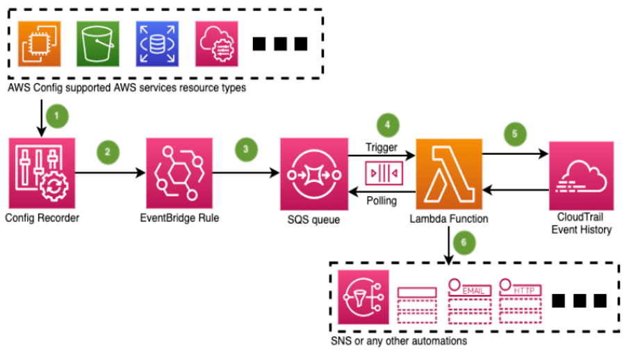

## How to setup notifications of which user or role made changes to a resource using AWS Config and CloudTrail

This solution uses AWS Lambda function to ingest resource Configuration Item change notification generated by AWS Config service. The Lambda function then performs an event lookup in AWS CloudTrail to identify the principal and event resulted in the Configuration Item change notification. After that the Lambda function publishes the finding to an Amazon SNS topic.

For more details, please refer to the associated blog post. 

### How the solution works

The following diagram illustrates the solution architecture:

1. Whenever a create, update or delete event occurs for a resource that’s [supported](https://docs.aws.amazon.com/config/latest/developerguide/resource-config-reference.html) by AWS Config, the AWS Config Recorder will record the configuration change as a CI for that resource to track the changes. Note that AWS Config is a regional service. Therefore, the solution must be deployed on a regional basis. 

2. The EventBridge Rule can capture the Config CI Change event notifications for the resource types that are being recorded. The CloudFormation template has a parameter to set the event pattern filter for certain resources types. By default, the event pattern will capture all of the resources type(s) your [Configuration Recorder](https://docs.aws.amazon.com/config/latest/developerguide/stop-start-recorder.html) is currently recording. This doesn’t affect the Configuration Recorder.

3. Once captured, the EventBridge Rule then passes the message to an SQS queue.

4. The SQS queue has a 10 minute delivery delay, and after that it triggers the Lambda function to poll the message from the SQS queue. The 10 minute delay allows sufficient time for the resource configuration change event to be propagated in CloudTrail.
 
5. Then the Lambda function extracts the resource details from the polled message, and calls the CloudTrail LookupEvents API on the resource name or ID for 15 minutes before the CI creation. The LookupEvents API returns the correlated API event, which includes the user principal. Because it takes a short moment for AWS Config Recorder to record the resources, the API event time will have an earlier timestamp than the CI capture time.

6. Finally, the Lambda Function processes the information for further automations. In this demo, it will publish an Amazon SNS notification that includes the resource ID, resource type, CI capture time, event name, event time, user principal, links to console, etc.

Note that some resource types currently don’t support LookupEvents API by resource name/ID. Resource CI could also be recorded due to the resource’s [ephemeral workloads](https://docs.aws.amazon.com/config/latest/developerguide/faq.html) or during the Config Recorder baselining process, rather than a direct API call made on the resource. In these situations, the LookupEvents API won’t be able to return an event related to the CI recorded. Therefore, the Lambda function will publish a direct AWS Console link to the resource CI instead. 

## Security

See [CONTRIBUTING](CONTRIBUTING.md#security-issue-notifications) for more information.

## License

This library is licensed under the MIT-0 License. See the [LICENSE](LICENSE) file.

